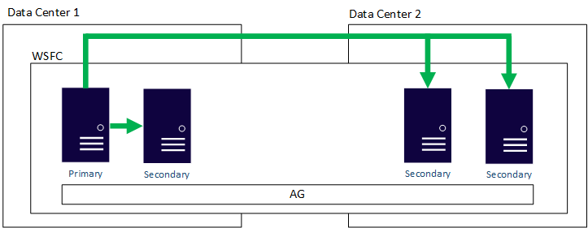

# High availability and disaster recovery

- RTO: Recovery time objective. Time needed to bring back service online.
- RPO: Recovery point objective. Maximum acceptable data loss.

## SQL Server

FCI: Failover cluster instance. Multiple nodes. If one crash another will be started. Need a common storage.

- has a unique name/IP (different from underlying servers in the cluster).
- User use the FCI name from the node actually used.
- If used in Azure: internal load balancer (ILB) is needed.
- When fail over the another node entire instance restart on another node (interruption).
- New instance goes through recovery process.
- Every objects will be there.
- Technically no data loss since it will load the same data (shared).
- Data become the SPOF.

AG: Availability group

- Data copy synchronously or asynchronously.
- Secondary replica are in loading state (can receive transaction but not writeable copy until it becomes primary).
- Standard edition can have 2 replicas (one primary/one secondary).
- Enterprise edition can support 9 replicas.
- Secondary replica is initialized from a backup of the database.
- Or with "automatic seeding" (MSSQL 2016) using log stream.
- Abstracted with the listener.
- Listener can by bypassed. 
- Enterprise edition: Secondary replicas can be read.
- Quicker failover time than FCI.
- Objects outside of database are not capture.

Log shipping: Maintain another database up to date

- First take a full backup
- Restore it in a loading state (standby/norecovery).
- Automated process will backup the transation logs/copy to the standby server and restore it.

## Azure

Availability set: Provide a way to avoid single point of failure. 

- Update domain
- Fault domain

Availability zones: Different data center in the same region.

Azure site recovery: Replicates VM to another region. Unaware of the VM usage (database, ...). Easy to meet RTO but not RPO.

## PaaS

- Azure SQL Database: 
    - Active geo replication
- Azure SQL Database (managed instance):
    - Autofailover group

SLA 99.99% for Azure Database for MySQL

## IaaS

### HA - Always on availability group:

- (FSW-File share witness ?)
- High availability not disaster recovery.

- Protects data by having more than one copy.
- Can meet RTO/RPO if implemented properly.
- Easy and standardized.
- Enhanced availability during patching.
- No shared storage.

### HA - Always on Failover Cluster instance:

Was more popular with physical deployment and maybe less useful in a virtualized world.

DR still not handled.

- Still popular solution
- Shared storage is easier with Azure Shared Disk.
- Can meet RTO/RPO
- Easy and standardized
- Enhanced availability during patching.

### DR - Multi region or Hybrid always on availability group

- Same as 1st example but on multiple region or hybrid (on prem).
- All nodes in the same Windows Server Failover Cluster (WSFC).
- Assume good network.
- Biggest consideration: WSFC.
- AD DS/DNS availability in every region.

- Proven solution
- Standard and enterprise editions of SQL Server
- AGs provide redundancy (multiple copies)
- AH + DR

### DR - Distributed availability group

- Enterprise edition only.
- Primary replica is global primary.
- Primary on the second AG is forwarder.
- AG of AGs.
- Easier quorum. Own witness.
- Separate WSFC as a SPOF.
- Not one primary to synchronize all secondary.
- Failing back from on location to another.

### DR - Log shipping

- One of the oldest method for DR.
- Use transaction log so data loss will occur except if "warm standby" is enabled.
- Tried and true feature for 20 years.
- Easy to deploy/administer.
- Tolerant of network that are not robust.
- Meets most RTO/RPO for DR.
- Good way to protect FCI.

### DR - Azure site recovery

- Not SQL server based DR solution.
- Usually database centric approach is preferred (lower RPO).
- Will work with more than just SQL server.
- Meet RTO and maybe RPO.
- Provide as part of Azure.

## Hybrid

Network is really important with hybrid solution.