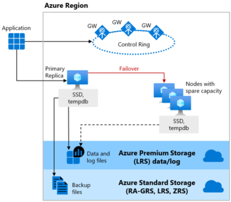
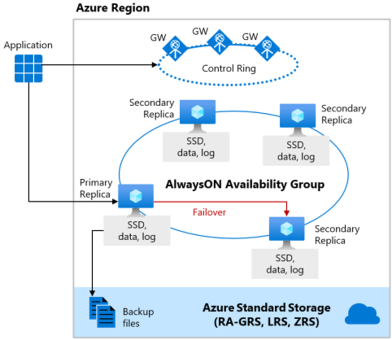
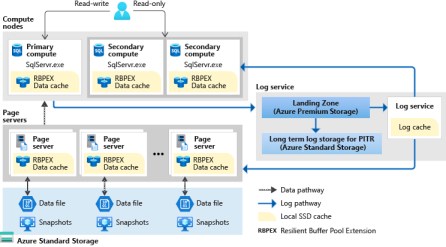

# Design for relational data

## Azure SQL Database
- Fully managed SQL server
- Abstract OS & SQl Server
- Manage configuration/high availability/backup
Management updates
- Up to 100TB
- Autoscaling for unpredictable workload (serverless)
- SQL Database elastic database pool: all databases in the pool share the same set of compute/storage ressources.

### Pricing
DTU (Database transaction unit): Measure of compute/storage/IO resources. Simple preconfigured option.
VCore : Number of virtual core to have a better control over computer costs. Azure Hybrid Benefit for SQL. Reserved capacity.
Serverless (f): Single database. Bills only for the amount of compute used.

## Azure SQL Managed instance
- Fully managed service
- Lift and shift (move to Azure without redesign)
- Instance scoped features (SQL server agent, CLR, database mail, distributed transaction).
- VCore mode only
- All databases in the instance share the ressources allocated.

## SQL Server on Azure VM
- SQL Server full capability
- Responsible for OS and SQL Server update
- Azure hybrid benefit

## Scalability
Vertical scaling with SQL database elastic database pools.

DTU : Basic/Standard/Premium
vCore: General purpose/business critical

Horizontal scaling.
- Sharding: Partition data across a set of SQL databases that are identically structured
- Read scale-out: Read workload on read only replica.
    Azure SQL Managed instance :
    - Basic/Standard/General purpose: Read scale out unavailable.
    - Business critical: Read scale out auto-provisioned
    Azure SQL database : 
    - Basic/Standard/General purpose: Read scale out unavailable.
    - Business critical/Premium: Read scale out auto-provisioned
    - Hyperscale: Read scale out available if at least one secondary replica is created.

##  Availability

General purpose/Standard tiers use FCI (relying on Azure service Fabric).

Business critical/premium use Availability group.

In this tier there are 3 secondary replica. One can be used as read only.
A transaction can complete when at least one secondary replica has hardened the change for its transaction log.

Hyperscale availability
Tiered layer of caches and page server. Ability to quickly access database pages without having to access the data file.

Use snapshot => Nearly instantaneous database backups
Restore take minutes (instead of hours/days).

VCore : General Purpose/Business critical/Hyperscale
DTU: Standard/Basic/Premium

## Security
Encryption:
Data at rest: Transparent data encryption (TDE) 
Data in motion: SSL/TLS
Data in process: Dynamic data masking (specific data is unencrypted, remaining data is encrypted).

Data classification : Public/confidential/Restricted

## Azure SQL Edge
For IoT and IoT edge
Same engine as SQL Server/Azure SQL.

COntainerized linux app.
Startup memory less than 500MB.

Azure SQL Edge developer : 
Limited to 4 cores and 32 GB. Dev only.
Azure SQL Edge: 
Limited to 8 cores and 64 GB.

Two deployments.
Connection deployment (Azure marketplace).
Disconnected deployment (docker hub image).

## CosmosDBD
Fully managed NOSQL database.

Single digit ms response time.

Latency : Single digit ms for read write. < 10 ms for read and < 15 ms for write (99th percentile).
Throughput: > 10 million operations/s per table.
- Indexing : Automatic
- Consistency: 5 consistency level.
- SLA: 99.99% for single region and multi-region with relaxed consistency. 99.999% read availability on multi-region.