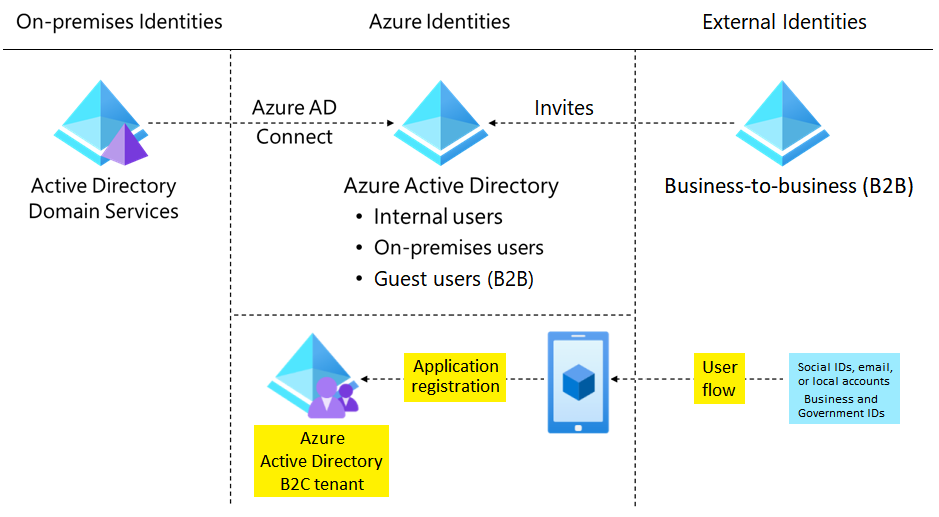

# Auth

## Entra ID
- Consider benefits of centralized identity management
- Consider using a single Microsoft Entra instance.
- Consider limiting account synchronization
- Consider password hash synchronization
- Consider single sign-on (SSO)
- Consider single sign-on (SSO)

## B2B
Guest users.

- Consider designating an app owner to manage guest users
- Consider conditional access policies to control access
- Consider the benefits of using MFA
- Consider integration with identity providers
- Consider self-service sign-up user flow

## B2C
Azure AD B2C is a type of Microsoft Entra tenant for managing customer identities and their access to your apps.

- Consider reusable flows for user journeys
- Consider allowing users to sign in with their social identities
- Consider a customizable user interface to support branding
- Consider integration with external user stores
- Consider third-party identity verification and proofing.

## Conditional access

Report-only mode helps admins evaluate the impact of Conditional Access policies before enabling them in their environment.

The What If tool helps you plan and troubleshoot Conditional Access policies.

- Consider MFA for more granular control
- Consider preventing access from specific geographic areas
- Consider access only from managed devices
- Consider access only from approved client apps
- Consider using policies to handle compromised accounts.
- Consider blocking access.
- Consider blocking legacy authentication protocols.
- Consider running Report-only mode.
- Consider using the What If tool.

## Identity protection

- Automate the detection and remediation of identity-based risks.
- Investigate risks by using data in the Azure portal.
- Export risk detection data to other tools.

User risk represents the probability that a given identity or account is compromised.
Sign-in risk represents the probability that a given sign-in (authentication request) isn't authorized by the identity owner.

- Consider "High" threshold for user risk policy.
- Consider "Medium and above" threshold for sign-in risk policy.
- Consider investigating risks in the Azure portal.
- Consider exporting your risk detection data.

## Access review
An Microsoft Entra access review is a planned review of the access needs, rights, and history of user access.
Reviewers : 
- Resource owners: The business owners of a resource.
- Delegates: A group of individuals selected by the access reviews admin.
- End user: A user who self-attests to their need for continued access.

## Service principals

An app can be represented in Microsoft Entra ID: as an application object, or by a service principal.

Application objects: Although there are exceptions, an app object can be considered the definition for an app. 
Service principals: The service principal for an app can be considered an instance of an app. Service principals generally reference an app object. One app object can be referenced by multiple service principals across directories.

3 types of service principals:
- Application
- Managed identity : They are always linked to an Azure Resource, not to an application or 3rd party connector – They are automatically created for you, including the credentials; big benefit here is that no one knows the credentials
    - User assigned
    - System assigned
- Legacy

- Consider how to create your application service principals
- Consider service principals without managed identities when you want to be able to manage the credentials
- Consider authentication of external apps to Azure resources by using service principals
- Consider the best practices for requesting permissions
- Consider restricting user consent

## Managed identity

- Consider your Azure services and your targets
- Consider using system-assigned managed identities when single resource or independant identities
- Consider choosing user-assigned managed identities when multiple resources
- Consider the benefits of managed identities for VMs in Azure
- Consider Azure Key Vault authentication for Azure resources.

## Azure Key Vault
- Manage secrets
- Manage keys
- Manage certificates

Standard tier lets you encrypt your data with a software key.
Premium tier offers hardware security module (HSM)-protected keys.

- Consider using separate key vaults to decrease "blast radius".
- Consider access to the key vault. Secure access to your key vaults by allowing only authorized applications and users.
- Consider data protection for your key vault.
    - Soft delete
    - Purge protection