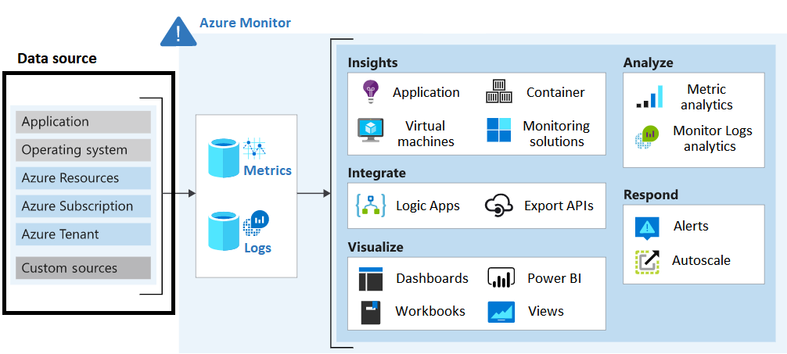

# Log and monitor

## Azure monitor

- Consider data sources and data access. 
- Consider queries on Logs data. 
- Consider alerts based on Logs and Metrics data. 
- Consider Metrics Explorer to analyze metrics interactively. 

## Azure monitor logs
Azure Monitor stores log data in an Azure Monitor Logs (Log Analytics) workspace.
A workspace is an Azure resource that serves as an administrative boundary or geographic location for data storage.

- Consider your access control strategy
    - Centralized : Every teams use the same workspace
    - Decentralize: Each team has its own workspace
    - Hybrid: Hard to maintain

- Consider access mode:
    - Resource context
    - Workspace context
    - Consider Azure RBAC and workspaces
    - Consider scale and ingestion volume rate limit

## Workbook & Insight

- Consider Azure Workbooks
- Consider Azure insights and data analysis
- Consider combined data sources and visual reporting

## Azure data explorer
- Consider native capabilities in Azure Monitor.
- Consider features of Microsoft Sentinel.
- Consider advantages of Azure Data Explorer.