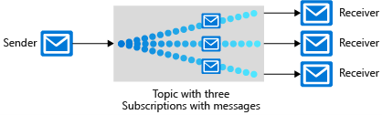

# Application architecture

## Describe message and event scenarios

### Message

- Contains raw information produced by one component and consumed by another
- Message contain data and not just a reference
- Producer expect message to be processed

### Event

- Lighter
- Used to broadcast information
- Publishers (send event) and receivers (receive event)
- Goes through intermediary (event grid, ...)
- Indicate something occured
- Can have multiple receivers or none
- Publisher has no expectation

Consider:

- Message and event can be used both together by the same app.
- Sender expectation: if there is expectation from the sender use message instead of event.

## Design messaging solution

Two Azure message based solution: 

### Azure storage queue

    - Can contain millions of messages
    - Number and size of queues only limited by the storage account
    - REST based interface
    - Reliable
    - Guarantee message delivery
    - Transactional support
    - Audit trail of all messages
    - Can exceed 80GB

### Azure service bus

    - Message broker
    - Support message queue and publish/subscribe
    - Load balance against competing workers
    - At most one one delivery
    - At most one processing (peeklock)
    - At least one processing (receive and delete)
    - Group messages into transaction
    - Receive message without polling
    - Message can be large than 64kB
    - Queue will not exceed 80GB

Message queue

-

Publish/subscribe

## Azure event hub

Big data streaming platform and event ingestion service.

- Real time data ingestion 
- Send/receive events in many different language
- Message can be received from Azure event hub by using Apache storm
- Events received are added to the end of its data stream
- Pull model
- Messages are not deleted and remain available
- Does not have a built-in mechanism to handle messages that aren't processed.
- Scale according to the nubmer of pruchased throughput units.

Tiers : Basic, standard, premium

Consider : 

- Common implementations: dashboarding, analytics, detecting anomolies, ...
- Language and frameworking integration
- Pricing tier and throughput unit.
    - Single through unit equates to:
        - Ingress: Up to 1MB per second or 1000 events per second (wichever comes first)
        - Egress: Up to 2MB per second or 4096 events per second
- Pull model benefit: When a message is read it's not deleted
- Message failure: No handled. Message remains until time to live settings has expired
- Data stream access: consumers can seek along the data stream using time offsets

## Design an event-driven solution

Azure event grid is a fully managed event routing service that runs on Azure Service Fabric.

- Aggregates all events and provide routing from any source to any destination
- Events are distributed to handlers like Azure functions and Azure DevOps webhooks.

- Events are tagged with one or more topics
- Event handler subscribe to topics
- Event grid route events based on topics
- Event are empty. Only URL or identifier to the changed objects.

Consider:
- Multiple services: 
    - Azure event grid: Reactive programming - Event distribution
    - Azure event hubs: Big data pipeline - Event streaming (series)
    - Azure service bug: High-value enterprise messaging - Message

## Caching solution

Caching effective when: 

- Original data remains relatively static
- Slow compared to the speed of cache
- Subject to a high level of contention
- Far away and network latency can result in slow access to the store

Azure cache for Redis provide in memory data store based on Redis.

- Two implementation options:
    - Redis Open Source (OSS)
    - Commercial product from Redis labs
- Secure and dedicated Redis server instances and full Redis API compatibility.
- Can be used as distributed data or content cache, sesion store or message broker.

## API integration

Azure API Management is a cloud service platform for publishing, securing, maintaining and analyzing all APIs. 

It does not host the API it's just a front door.

Consider: 

- Number of APIs: The more API you have the greather the need for deployement standardization and centralization of API control.
- Rate of API changes
- API administration load: Policies allow to centrally managed APIs
- Standardiying disparate APIs
- Centralized API management
- Enhanced API security

## Automated app deployment

ARM templates define the infrastructure and configuration for your deployment.

- ARM template are idempotent
- Deployed in parallel
- Whatif parameter (powershell/Azure CLI) to preview changes
- Validated before deployement
- Can break up ARM templates into smaller components
- ARM templates can be integrated into multiple CI/CD

Bicep is a domain-specific language. Bicep is used to create ARM templates.

- Bicep is native to Azure ecosystem. When new Azure resources are releases/updated Bicep will support those features on day one.
- Transition to Bicep is easy.

Azure automation

- process automation: automate frequent, time consuming and error prone cloud management task. 
- configuration managemment
- update management: create schedules deployment that orchestrate update installation

## App configuration management

Azure app configuration provides a service to centrally manage application settings.

- Fully managed service supports native integration with popular frameworks
- Flexible key representations and mapping and point in time replay of settings
- Dedicated UI for feature flag management
- Can compare two sets of configuration on custom-defined dimensions
- Sensitive information can be encrypted at rest and in transit
- Dev and prod environements