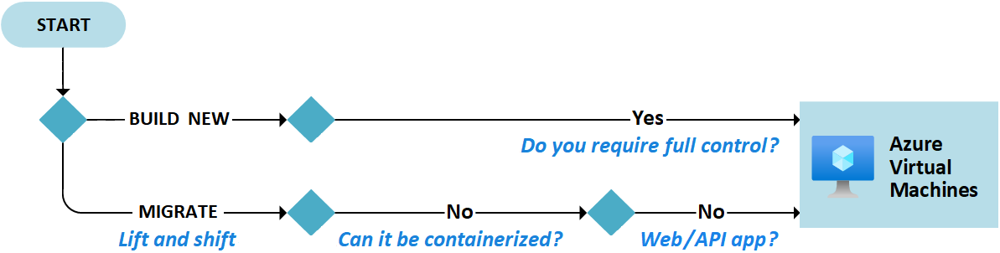
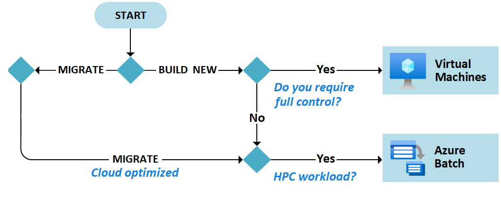
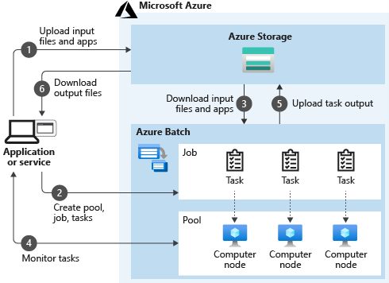
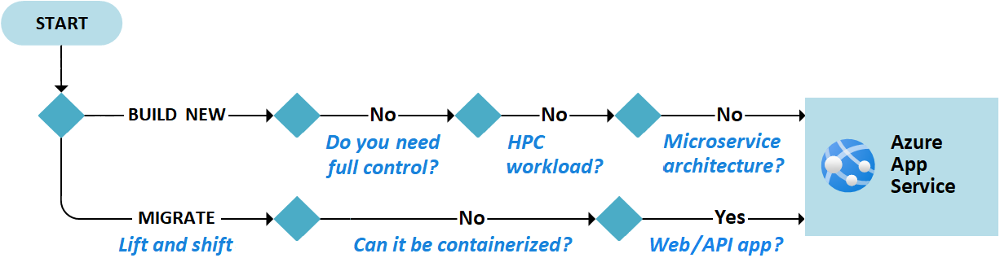
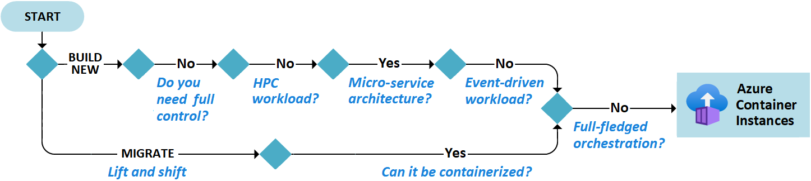
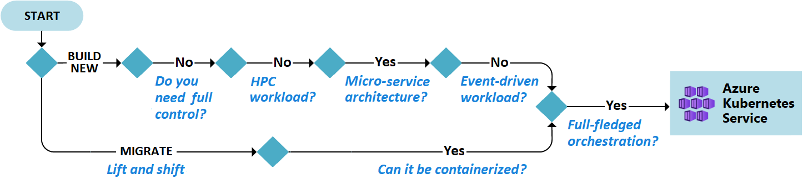
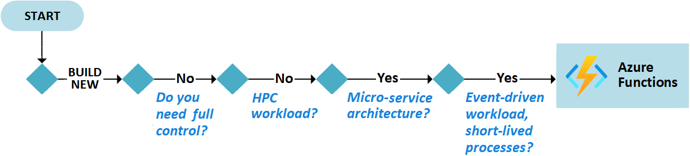
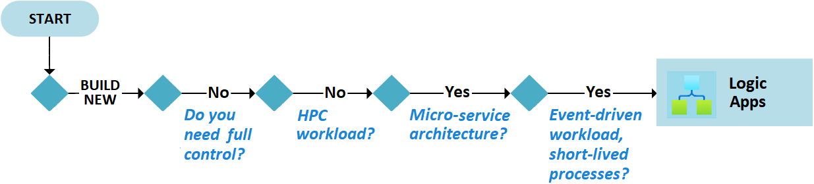
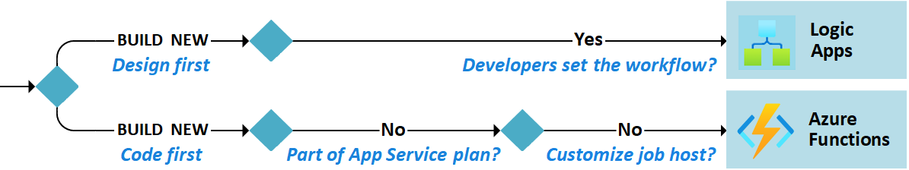

# Azure compute service

## Choose Azure computer service

- Azure VM
- Azure Batch: Run large-scale parallel and high performance computing (HPC) app.
- Azure app service: Host web apps, API, ...
- Azure functions: Run code without worrying about infrastructure
- Azure logic apps: Automated worflow similar to capabilities in Azure functions.
- Azure container instances: Run containers.
- Azure Kubernetes service: Run kubernetes (container orchestrator)

Consider :

- Architecture and infrastructure requirements:
    - Microservices, full fledged orchestration, serverless
- Support for new workload scenarios:
- Control : Need full control over installed software/app ?
- Workload: HPC workload or event driven worload?
- Required hosting options:
    - IaaS
    - PaaS
    - FaaS (Function)
- Support for migrations:
    - Cloud optimized
    - Lift and shift
    - Containerized

Workflow:

## Azure VM

- IaaS
- Build new if full control need
- Lift and shift when no way to containerized.
Consider :
- Network
- Name the VM and decide the location
- Determine the size
- Review pricing model (Compute cost + storage cost)
- Select OS

## Azure Batch

- Great for parallel workload
- Do for you:
- Start a pool of compute VM
- Install app and staging data
- Run jobs
- Identifies failure, requeues work and scale down the pool as work completes

Consider:
- Pools: If short running task don't create a new pool for each job.
- Nodes: Single node is not reliable.
- Jobs: Uniquely name your job for monitoring and logging.

## Azure App service

- HTTP based
- Offer automatic scaling and high availibity.
- PaaS
- Built-in load balance and traffic management
- Provide built-in auth (easy auth)
- Price depending on the app service plan
- Build new:
- No full control
- No HPC worload
- No microservice architecture.
- Lift and shift:
- No containerized
- Web API/APP

## Azure container instances

- No full-fledged orchestration
- Lift and shift if can be containerized
- Build new :
    - No full control
    - No HPC
    - Microservice
    - No event driven worload
- Container group is the top level resource. Collection of container scheduled on the same host.

Consider:

- Private registry
- Ensure image integrity
- Monitor container resoruce activity

## Azure Kubernetes service

- Cluster is free. Only pay for the VM running the nodes.
- Give you the benefit of K8S without the complexity/overhead of running your own cluster.

## Azure functions

- Charge for the resources used only.

Consider:

- Long running function: Avoid large/long-running function. Default timeout is 300s for consumption plan and 30 minutes for other plans.
- Durable function: Stateful function. Function chaining.
- Performance and scaling. Functions with different needs should be in different function app.
- Defensive function
- Not sharing storage account: Separated storage account for each function app.

## Azure Logic app

