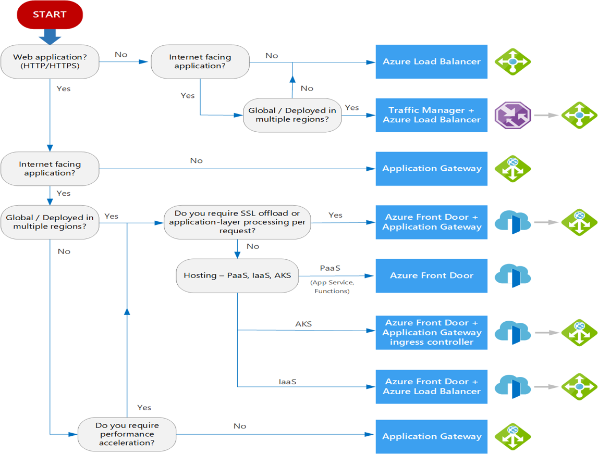

# Networking

- Naming: Be consistent to ease management.
- Regions: Determine Azure region based on consumers physical location.
- Subscriptions: Plan out how many subscriptions are required.
- IP addresses: Specify a custom private ID address.
- Segmentation: Segment in subnet based on workload/security requirements.
- Filtering: Define your security and traffic filtering. (NSG)

Plan ID addressing

    - Max 65536 IP addresses by vnet.
    - CIDR should not be greater than /16. If greater the number of IP will be greater than 65536 and will not be usable (waste of addresses).
    - Don't overlap VNET address space with on prem.
    - If overlap you need to redesign or use NAT.

## Design pattern

3 common patterns: 

- Single VNET
    - All components are in the same VNET.
    - Only possible if every ressources are in a single region.
    - Segmentation done via NSD/ASG and subnet.
- Multiple VNET with peering
    - Need to do peering explicitly if needed.
    - Peering is not transitive.
- Multiple VNET in a hub-spoke topology
    - Hub is a VNET acting as a central point of connectivity. 
    - Spoke are VNET connected to hub (peering).
    - Shared service are deployed in hub
    -Individual workload are deployed as spokes.

## Outbound connectivity and routing

### Azure VNET NAT

- Simplify outbound-only internet connectivity for VNET
- When configured all outbound connectivity use the specified IP addresses
- Outbound connectivity is possible without load balancer or public IP attached

### Routing

- System routes: 
    - Created when VNET is created
    - Can't be modified
    - Can be overridden with UDR
- User defined routes (UDR): 
    - When creating subnet Azure create default entries in the routing table to allow communication between subnet
    - Those routes can be modified by using static routes wich are stored as UDR
    - Also called *custom routes*
- Route from other VNET: 
    - When create VNET peering a route is added for each address range within each peered VNET
- Border Gateway Protocol routes (BGP): 
    - On prem gateway can exchange BGP route with VNET gateway
- Service endpoint routes
    - Public IP for certain services are added to the route table when service endpoint is enabled.
    - Enabled for individual subnet.
- Routing order:
    - When competing entries Azure select the longest prefix match.
    - If still competing it will choose in that order : UDR, BGP, system route.

## On prem connectivity to VNET

### Azure VPN Gateway 

- Send encrypted traffic between VNET and on prem.
- Goes through public internet.
- Different configurations:
    - Site to site
    - Point to site
    - VNET to network
- Up to 10 GBPS depending on SKU

### ExpressRoute

- Private, dedicated connection through third party connectivity provide.
- Traffic doens't go over internet.
- Up to 10 Gbps depending on connectivity provider

### ExpressRoute with VPN failover

- Combine both previous method
- If there is a lost of connectivity with ExpressRoute, VPN still up.

### Virtual WAN and hub-spoke networks

- Full meshed hub among Azure virtual networks
- Branch-to-Azure connectivity
- Branch-to-branch connectivity
- Mixed use of VPN Gateway and ExpressRoute connections
- Mixed use of user VPN to the site
- Virtual network-to-network connectivity

## application delivery services

- Azure load balancing services can be categorized in 2 dimensions:
    - Global or regional
    - HTTP(S) or non-HTTP(S)

### Azure CDN

- Global solution to deliver high bandwidth content to users
- Content can be cached across the world

### Azure front door

- Global solution
- Web traffic
- Priority: Support primary/secondary backends
- Weighted: Distribute traffic by using weight coefficients
- Affinity: Ensure request from the same end user are sent to the same backend
- Support WAF/CDN integration for HTTP(S) traffic

### Azure traffic management

- DNS based
- Global
- Priority
- Weighted

### Azure load balancer

- Regional
- Layer 4 (TCP/UPD)
- Health probe

### Azure application gateway

- Regional
- HTTP(S)
- Layer 7 load balancing capabilities
- Routing methods :
    - Path based
    - Multiple-site

## Application protection services

### Azure DDoS protection

- Provide countermeasure against most sophisticated DDoS threats.

### Azure private link

- Allow access to PaaS services (Azure storage, SQL database, ...) and Azure hosted services over a private endpoint in VNET.
- Traffic goes through MS backbone network.
- No longer necessary to expose service to the public internet.

### Azure Firewall

- Fully statefull firewall

### Azure Web application firewall

- Firewall for web app.
- Protection to OWASP 10 vulnerabilities.
- Can add custom rules

### VNET security group

- Can filter network traffic with NSG
- NSG contains access control list (ACL)
- NSG can be associated with subnet or NIC
- NSG contains two sets of rules : inbound/outbound
- Rules with priority

### VNET service endpoint

- Extends VNET adress space to Azure services over a direct connection.
- Traffic remain on MS backbone network.

### Azure bastion

- PaaS inside VNET
- Provide secure and seamless RDP/SSH connectivity to VM in Azure portal
- Protect against port scanning
- No need of public IP

### JIT network access

- Lock down inbound traffic to VM
- Used to reduce expose to attack while providing easy access to VM when needed.
- Inbound traffic allowed based on Azure RBAC