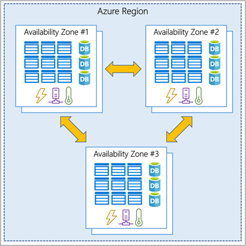

# Core architectural components

## Physical infrastructure
### Region

- A region is a geographical area on the planet that contains at least one, but potentially multiple datacenters.
- Most services are tied to a region.
- Some services are not tied to a region (Entra, Azure DNS, ...).

### Availability zone
- Isolated datacenter in a region.
- Independent power, cooling, networking.

Azure services that support availability zones fall into three categories:

- Zonal services: Specific to a zone.
- Zone-redundant services: Replicated in multiple zones.
- Non-regional services: Not specific to a zone.

### Region pairs

- Most region are pair to another region.
- Paired region is within the same geography.
- Paired regions are at least 300 miles apart.
- In case of region failure some services will fail over to the other region.

### Sovereign regions

- Region isolated from the main instance of Azure.
- China, US DoD, ...

## Logical infrastructure

### Resources
- Building blocks.
- Can be created/provisionned/deployed.

### Resource groups
- Grouping of resources.
- Resource group is required to create a resource.
- Resource group can contains multiple resources.
- Resources can only be in one group.
- Resource groups can't be nested.
- Action like "deletion" will delete the group and every resources it contains.

### Subscriptions

- Unit of management/billing/scale.
- Account can have multiple subscriptions.
- At least one is needed.
- Could be created by:
   - Environments (dev, test, prod, ...)
   - Organizational structures (departements, ...)
   - Billing

### Management groups
- Grouping of subscriptions.
- Can be nested.
- Allow to apply policies to multiple subscriptions.
- Allow to apply access control to multiples subscriptions.
- 10k management groups are supported in a single directory.
- Up to 6 levels of depth (excluding root and subscription level).
- Management group and subscription can only have one parent.

